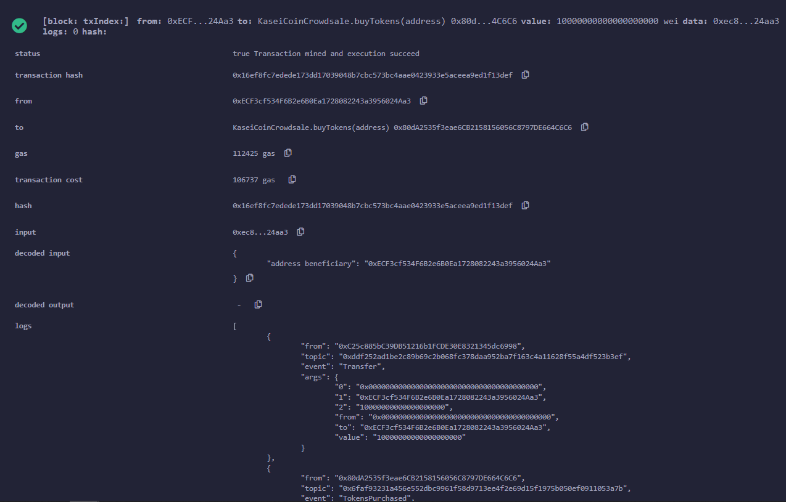
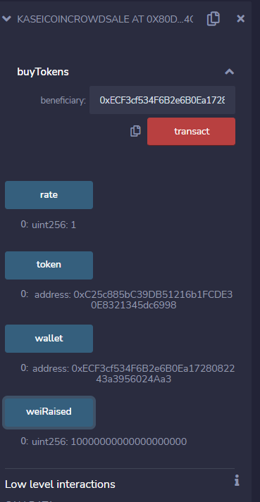
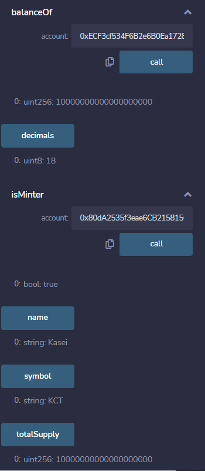

# module_21_challenge
# Token Crowdsale
We are creating a contract for a crowdsale of Tokens which will be bought using ETH. 
-------------------------------------------------------------------------------------------------------------------------

## Technologies Used
We used Solidity 0.5.0, MetaMask, openZepplin, ERC20, and Ganache.  
-------------------------------------------------------------------------------------------------------------------------

## Installation
We will need to install MetaMask a google chrome extension and Ganache to get test accounts and Ganache. 
-------------------------------------------------------------------------------------------------------------------------

## Example
We will create a contract for the token itself then create a seperate contract for the deployer and mintable. With deploying the token we add the deployer and mintable. We can check to see who can mint tokens, renounce minters, and add minters.
-------------------------------------------------------------------------------------------------------------------------

## Images
Buying Tokens

Contract for the crowdsale

Addition to the minters checking to see who is a minter and balances.

